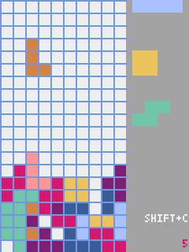
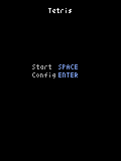

[en](./README.md)

# Pyxel.Tetris

　テトリス（Pyxel製）

# デモ





# 開発環境

* <time datetime="2020-04-14T18:13:05+0900">2020-04-14</time>
* [Raspbierry Pi](https://ja.wikipedia.org/wiki/Raspberry_Pi) 4 Model B Rev 1.2
* [Raspbian](https://ja.wikipedia.org/wiki/Raspbian) buster 10.0 2019-09-26 <small>[setup](http://ytyaru.hatenablog.com/entry/2019/12/25/222222)</small>
* bash 5.0.3(1)-release
* Python 3.7.3
* [pyxel][] 1.3.1

[pyxel]:https://github.com/kitao/pyxel

```sh
$ uname -a
Linux raspberrypi 4.19.97-v7l+ #1294 SMP Thu Jan 30 13:21:14 GMT 2020 armv7l GNU/Linux
```

# インストール

　3.7以上のPythonをインストールする。

　次に以下のように[pyxel][]をインストールする。

* [pyxel/README](https://github.com/kitao/pyxel/blob/master/README.ja.md#%E3%82%A4%E3%83%B3%E3%82%B9%E3%83%88%E3%83%BC%E3%83%AB%E6%96%B9%E6%B3%95)

```sh
sudo apt install python3 python3-pip libsdl2-dev libsdl2-image-dev
git clone https://github.com/kitao/pyxel.git
cd pyxel
make -C pyxel/core clean all
pip3 install .
```

# 使い方

```sh
git clone https://github.com/ytyaru/Python.Pyxel.Tetris.20200424000000
cd Python.Pyxel.Tetris.20200424000000/src
./run.sh
```

## スタート画面

意味|キー
----|----
プレイ開始|`SPACE`
キーコンフィグ|`Enter`


## キーコンフィグ画面


意味|キー
----|----
戻る|`Shift`+`Q`
保存|`Ctrl`+`S`
カーソル移動|`↑`,`↓`
選択決定|`PgUp`,`PgDn`

　キーコンフィグは設定を3つまで保存できる。そのうちどれかひとつを選択して使用する。

　キーの変更は以下のように行う。

1. カーソルを変更したい項目に合わせる
1. 設定したいキーを押す

　キーの重複不可。もし設定済みキーを他の項目に設定したいときは、一旦別のキーを指定すること。

### デフォルト設定

　`0:Default`を選択している。

項目|0:Default|1:HomePosition|2:User
----|---------|--------------|------
Move left|`←`|`S`|`S`
Move right|`→`|`F`|`D`
Roll left|`L`|`J`|`A`
Roll right|`R`|`L`|`F`
Speed up|`↓`|`D`|`G`
Fall|`Space`|`Space`|`Space`


## プレイ画面

意味|キー
----|----
キーコンフィグ|`Shift`+`C`
ミュート切替|`F3`

* キーコンフィグ画面で設定・選択したキーを使って操作する


## ゲームオーバー画面

* 消した行の数が表示される
* `R`キー押下するとリトライできる


# 注意

* バグ。落下予測テトリミノが下端より下へめり込んでしまうときがある
* 音が出る。テトリミノを置いたときに。消音設定はない

# 著者

　ytyaru

* [](https://github.com/ytyaru "github")
* [](http://ytyaru.hatenablog.com/ytyaru "hatena")
* [](https://mstdn.jp/web/accounts/233143 "mastdon")

# ライセンス

　このソフトウェアはCC0ライセンスである。

[](http://creativecommons.org/publicdomain/zero/1.0/deed.ja)

